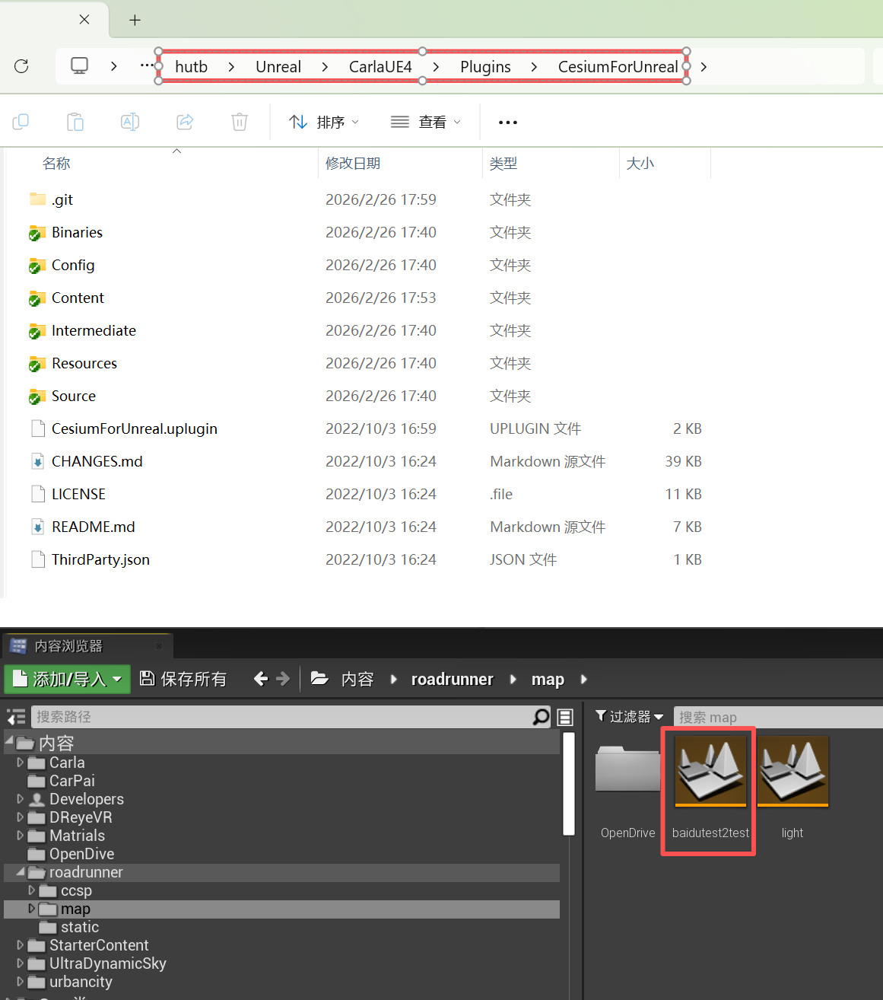
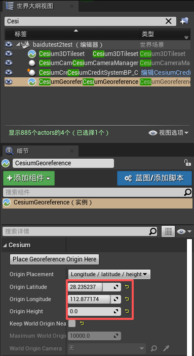
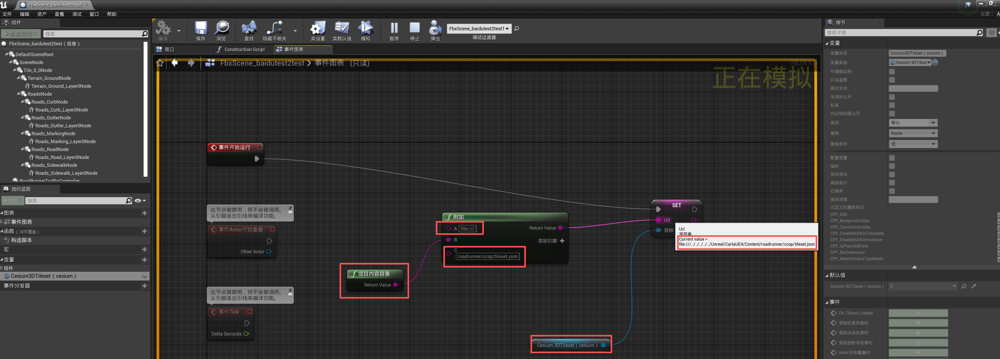

# 倾斜模型导入Carla

## 导入道路和红绿灯

0.将 [链接](https://pan.baidu.com/s/1n2fJvWff4pbtMe97GOqtvQ?pwd=hutb) 中的 <font color="#00a6ed">software/cesium/RoadRunner插件.zip</font> 解压到 <font color="#00a6ed">hutb\Unreal\CarlaUE4\Plugins</font> ，运行`make launch`重启编辑器。

1.在 <font color="#00a6ed">hutb\Unreal\CarlaUE4\Content\roadrunner</font> 中新建 <font color="#00a6ed">static</font>（放资产）和 <font color="#00a6ed">map</font>（放地图）；

在编辑器中static目录中右键导入 <font color="#00a6ed">baidutest2test.fbx</font> 。
导入选项：
勾选 纹理中 <font color="#00a6ed">反转法线贴图</font> 。


2.将 <font color="#00a6ed">light.umap</font> 拷贝到 <font color="#00a6ed">hutb\Unreal\CarlaUE4\Content\roadrunner\map</font> 路径下。

3.在虚幻编辑器中点“文件”菜单中的“将当前关卡另存为”（方便管理，把地图和红绿灯放一块），选择 <font color="#00a6ed">hutb\Unreal\CarlaUE4\Content\roadrunner\map</font> 

4.将 <font color="#00a6ed">light.umap</font> 引入到 <font color="#00a6ed">baidutest2test.umap</font>（虚幻编辑器中点“窗口”菜单中的“关卡”，将`内容浏览器`中的 <font color="#00a6ed">hutb\Unreal\CarlaUE4\Content\roadrunner\map\light</font> 拖入到关卡窗口中 -> 右键light，修改流送方式->固定加载）。

5.将 <font color="#00a6ed">hutb\Unreal\CarlaUE4\Content\Carla\Maps\OpenDrive\baidutest2test.xodr</font> 拷贝到 <font color="#00a6ed">hutb\Unreal\CarlaUE4\Content\roadrunner\map\OpenDrive\baidutest2test.xodr</font> 


## 倾斜模型导入 HUTB

1.下载并解压 [Cesium for Unreal 插件](https://github.com/OpenHUTB/cesium) 到插件目录`hutb\Unreal\CarlaUE4\Plugins\CesiumForUnreal`下：




!!! 注意
    只有加载了 Cesium 插件后才能在`内容浏览器`中看到地图`baidutest2test.umap`。

2.如果CesiumForUnreal未启用，则在CarlaUE中添加插件

>> 
>> 
添加完成后重启引擎。

3.添加插件对象到场景中：

>>>  

添加插件对象到场景中：

从`世界大纲视图`中选中`CesiumGeoreference`，其中，原点的纬度`Origin Latitude`、原点的经度`Origin Longitude`、原点的高度`Origin Height`分别设置为
：`28.235238,  112.877178,  0`

>>> 

从`世界大纲视图`中选中`Cesium3DTileset`：
<font color="#00a6ed">Source</font> 设置为`File:///D:/model1/model1/tileset.json`。<br>

>>> 

!!! 注意
    从[链接](https://pan.baidu.com/s/1n2fJvWff4pbtMe97GOqtvQ?pwd=hutb) 中的 <font color="#00a6ed">map</font> 文件夹内下载<font color="#00a6ed">中电软件园_cesium_model.zip</font>并解压。这里测试用的是本地路径，也可以用静态资源服务。

[去掉](https://cloud.tencent.com/developer/article/2206873) <font color="#00a6ed">Keep World Origin Near Camear</font> 勾选。

!!! 笔记
    如果启用`Keep World Origin Near Camear`选项，在运行态下，世界坐标原点会随着镜头的变化而变化，从而导致所有的actor（非Geo对象）的坐标都产生变化。  一般建议在小场景下，关闭此选项。  该选项的目的是在大场景下，避免对象的坐标值很大，超过UE可以能够存储的精度。

（4.确定 Trees.umap 放到本地文件夹`roadrunner/map`下，菜单中点击 <font color="#00a6ed">窗口->关卡</font> ，从 <font color="#00a6ed">内容浏览器</font> 中将 <font color="#00a6ed">Trees.umap</font> 拖进导弹出界面，然后右键 <font color="#00a6ed">Trees</font> ，选择 <font color="#00a6ed">修改流送方法->固定加载</font> 。）

（5.在<font color="#00a6ed">世界大纲视图</font>中选中 <font color="#00a6ed">Cesium3DTileset</font> ，将 <font color="#00a6ed">Cesium</font> 中的 <font color="#00a6ed">Mobility</font> 修改为 <font color="#00a6ed">可移动</font> 。）

（6.添加光源 <font color="#00a6ed">定向光源(DirectionalLight)</font> 、<font color="#00a6ed">指数级高度雾(ExponentialHeightFog)</font>、<font color="#00a6ed">天空大气(SkyAtmosphere)</font>、<font color="#00a6ed">天光(SkyLight)</font>。）

7.模型在CarlaUE中的场景效果


!!! 注意
    在编辑器中如果运行时出现倾斜摄影模型部分不加载，则使用独立进程运行可全部加载。


## 倾斜摄影
由倾斜摄影osgb转换成3Dtiles格式（cesium可直接使用）。


## 导入中电软件园场景

1.[从源代码编译Carla](./build_windows.md)；

2.导入插件：roadrunner插件（包括RoadRunnerCarlaContent、RoadRunnerCarlaDatasmith、RoadRunnerCarlaIntegration、RoadRunnerDatasmith、RoadRunnerImporter、RoadRunnerMaterials、RoadRunnerRuntime）、Cesium插件；

3.导入 fbx 地图（导入选项都是默认），默认生成的地图是 <font color="#00a6ed">Content/Carla/Maps/roadbuild</font> ；

4.根据[倾斜模型导入Carla](./adv_cesium.md)的步骤添加除了建筑以外的其他资产；

5.导入自己设计的关卡：虚幻编辑器->窗口->关卡，从 <font color="#00a6ed">内容浏览器</font> 中将 <font color="#00a6ed">langan.umap</font> 、<font color="#00a6ed">tafficsign.umap</font>、<font color="#00a6ed">Trees1.umap</font>等关卡拖到弹出的 <font color="#00a6ed">关卡</font> 页面，并 <font color="#00a6ed">右键每个关卡->修改流送方法->固定加载</font> ；


## 打包地图

1.参考 [RoadRunner Scenario+CARLA联合仿真](https://zhuanlan.zhihu.com/p/552983835) 进行地图打包。


2.将打包后场景的 <font color="#00a6ed">WindowsNoEditor\CarlaUE4\Content\Carla\Maps\OpenDrive\baidutest2test.xodr</font> 文件拷贝到 <font color="#00a6ed">WindowsNoEditor\CarlaUE4\Content\RoadRunner\map\OpenDrive\baidutest2test.xodr</font> ，否则调用<font color="#00a6ed">client.get_trafficmanager(args.tm_port)</font>会出现<font color="#00a6ed">failed to generate map</font> 的错误。


3.报警告<font color="#00a6ed">WARNING: requested 30 vehicles, but could only find 0 spawn points</font>，重新运行场景即可。


### 相对路径加载资产

1. 在“世界大纲视图”中搜索 <font color="#00a6ed">FbxScene_baidutest2test</font> ，选中并点击`编辑Fbx...`


2. 右键“附加”（字符串-附件加），点击`添加引脚`由2个输入变成3个。其中 A 为: <font color="#00a6ed">file:///</font> ，B 从`项目内容目录`连接来，C 为: <font color="#00a6ed">roadrunner/ccsp/tileset.json</font>  

3. 右键加一个`项目内容目录`，连接到`附加`模块的输入`B`；


4. 在左边“我的蓝图”中新建一个变量，名字为 Cesium3DTileset（cesium）， 右边“细节”中的“变量类型”改变为 <font color="#00a6ed">Cesium3Dtiles -> 对象引用</font>


5. 右键 `获取 Cesium 3DTileset`，从`Cesium 3DTileset`中引出并输入选择 <font color="#00a6ed">SET url</font>（设置 Url），点击菜单中的`编译`，右边修改“默认值”（浏览）


6. `事件开始运行`向外引出到`SET`


* 问题：蓝图运行时错误："“无访问”正在尝试读取属性 Cesium3DTileset

    因为在 Cesium 瓦片集（Tileset）加载完成前，蓝图就试图对其进行操作

* 问题：不可编辑类默认对象中的此值。

    解决：将 Cesium3DTileset 拖动到不可编辑的地方（保存不了）。

* 报错：图表被连接到外部映射中的对象。

    原因：蓝图中引用了外部的 Cesium3DTileset。




选中交通灯，“细节”中的 BoxTrigger、TotalVolume起作用，调整缩放xy。

调出影响范围的函数

RoutePlanner证明路口和路是断开的

### 程序相对路径加载瓦片

```
File:///D:/hutb/Unreal/CarlaUE4/Content/roadrunner/ccsp/tileset.json
// this->Url = TEXT("File:///./roadrunner/ccsp/tileset.json");
this->Url = FPaths::Combine(FPaths::ProjectDir(), TEXT("/roadrunner/ccsp/tileset.json"));
```

FPaths::RootDir();// 返回引擎根目录路径（最后包含斜杠`/`） hutb/Build/engine/ 

FPaths::ProjectDir();    // 工程根目录：D:/hutb/Unreal/CarlaUE4/


参考[链接](https://community.cesium.com/t/loading-a-packaged-tileset-from-url/42367) 。


#### 源代码分析

加载的逻辑位于 `hutb\Unreal\CarlaUE4\Plugins\CesiumForUnreal\Source\CesiumRuntime\Private\Cesium3DTileset.cpp` 中的：
```shell
UE_LOG(LogCesium, Log, TEXT("Loading tileset from URL %s"), *this->Url);
this->_pTileset = MakeUnique<Cesium3DTilesSelection::Tileset>(
    externals,
    TCHAR_TO_UTF8(*this->Url),
    options);
```

记录的日志位于：`hutb\Unreal\CarlaUE4\Saved\Logs\`，
```text
[2026.03.01-04.29.06:991][869]LogCesium: Loading tileset from URL File:///D:/model1/model1//tileset.json
```

MakeShared（包括用于TUniquePtr的 [MakeUnique](https://zhuanlan.zhihu.com/p/433605801) ）：类似于C++中的 std::make_shared ，比直接用普通指针创建效率更高，因为智能指针内存包含两部分，除了数据本身的内存之外，还有一个控制块内存，普通指针创建时，会分别申请两次内存，而使用 MakedShared 只需要进行一次内存申请，因而效率更高。

MakeUnique 使用给定的参数分配一个类型 T 的新对象并将其作为 TUniquePtr 返回。

TCHAR_TO_UTF8(const TCHAR*): unicode到utf8的转换


## FAQ

####### VS 2022 编译时 engine\Engine\Plugins\Marketplace\CesiumForUnreal\Source\ThirdParty\include\CesiumGeospatial\S2CellID.h 报错：`error 2039: "string": 不是 "std" 的成员`
> 原因：问题源于 VS2019 后的语法检查更加严格，缺少必要的头文件
> 
> 解决：增加头文件：
> ```C++
> #include<iostream>
> ```


## 参考
- [Cesium for Unreal快速入门](https://zhuanlan.zhihu.com/p/365834299)
- [Cesium for Unreal 加载本地倾斜摄影](https://blog.csdn.net/ChaoChao66666/article/details/131569339)
- [RoadRunner Scenario+CARLA联合仿真](https://zhuanlan.zhihu.com/p/552983835)