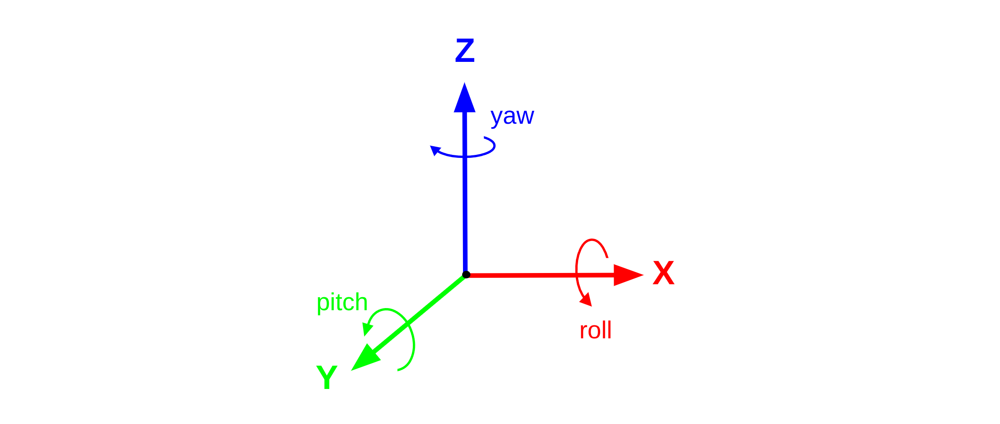
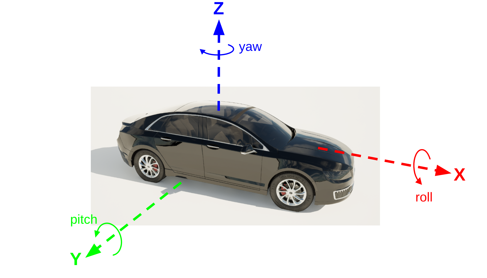

# 坐标和转换

本页详细介绍了 HUTB 中使用的坐标约定以及如何通过 HUTB Python API 处理坐标。

* __[全局坐标](#global-coordinates)__
* __[Actor 坐标](#actor-coordinates)__
* __[通过 HUTB API 处理坐标：](#handling-coordinates-through-the-carla-api)__
    * [位置](#location)
    * [旋转](#rotation)
    * [变换](#transform)
* __[地理坐标 Geocoordinates](#actor-coordinates)__

---

## 全局坐标

HUTB 基于虚幻引擎 4.26 版本构建，并采用相同的**左手坐标系**。您可以在 [模拟引擎文档](https://openhutb.github.io/engine_doc/zh-CN/Basics/CoordinateSpace/index.html) 中了解更多关于 [虚幻引擎坐标系](https://dev.epicgames.com/documentation/en-us/unreal-engine/coordinate-system-and-spaces-in-unreal-engine) 的详细信息。

对于站在原点、面向 X 轴正方向的观察者，适用以下关系：

* **X** - **前**
* **Y** - **右**
* **Z** - **上**




在 HUTB API 中，距离以米为单位测量，角度以度为单位测量。因此，当 HUTB 与其他可能使用**右手坐标系**、角度使用弧度、距离使用厘米或英制单位的应用程序交互时，进行相关的单位转换至关重要。

---

## Actor 坐标

车辆和其他 actors（如行人）都有自己的局部坐标系，以帮助保持局部一致的坐标关系，例如传感器位置。

按照惯例，HUTB 车辆的设置方式为：车头指向 X 轴正方向，车身右侧指向 Y 轴正方向，车顶指向 Z 轴正方向。车辆坐标系的中心通常靠近 X 轴和 Y 轴方向的边界框中心，并且非常靠近 Z 轴方向边界框的最低面。




HUTB 行人模型的设置方式也类似，行人面向 X 轴正方向，右臂指向 Y 轴正方向，头部指向 Z 轴正方向。通常情况下，行人模型的坐标中心在静止状态下位于边界框的中心。

## 通过 HUTB API 处理坐标：

HUTB API 具有多个用于处理坐标和坐标变换的实用对象。

### 位置 Location

[Location 对象](python_api.md#carlalocation) 用于定义坐标，并在变换中或在生成或移动对象和 Actor 时检索或应用这些坐标。 

以下代码展示了如何创建一个位置对象，表示 X=10m、Y=10m、Z=1m 处的坐标：

```py
# 带位置参数的默认构造函数
location = carla.Location(10,10,1)

# 使用关键字参数
location = carla.Location(x=10,y=10, z=1)
```

---

### 旋转

[Rotation 对象](python_api.md#carlarotation) 用于定义 HUTB 坐标系中的旋转。旋转以欧拉角形式定义，包括横滚角、俯仰角和偏航角。欧拉角的单位为度。

以下代码展示了如何创建一个旋转对象，使其横滚角为 10 度，俯仰角为 10 度，偏航角为 90 度：

```py
rotation = carla.Rotation(roll=10, pitch=10, yaw=90)
```

关键字参数可以省略，相应的角度将被设置为零。旋转动作**默认**按**俯仰(pitch)**、**偏航(yaw)**、**橫滾(rall)** 的顺序进行。

---

### 变换 Transform

HUTB [Transform 对象](python_api.md#carlatransform) 用于包含有关对象姿态的所有信息，包括其 3D 位置和旋转。可以使用 Location 和 Rotation 创建一个新的 Transform 对象：

```py
location = carla.Location(10,10,1)
rotation = carla.Rotation(yaw=90)
transform = carla.Transform(location, rotation)
```

此变换可用于生成诸如车辆之类的 actor：

```py
vehicle = world.spawn_actor(vehicle_bp, transform)
```

可以使用 `get_transform()` 方法查询 actor 的变换，并访问其关联的位置和旋转属性：

```py
print(vehicle.get_transform())
print(vehicle.get_transform().location)
print(vehicle.get_transform().rotation)

>>>Transform(Location(x=10, y=10, z=1.0), Rotation(pitch=0.0, yaw=90, roll=0.0))
>>>Location(x=10, y=10, z=1.0)
>>>Rotation(pitch=0.0, yaw=90, roll=0.0)
```

transform 对象提供了一些实用函数，用于将变换应用于其他坐标。可以使用 `transform()` 方法将与变换关联的平移和旋转应用于 Location 或 Vector：

```
location = carla.Location(1,0,0)
vehicle_transform = vehicle.get_transform()
transformed_location = vehicle_transform.transform(location)

>>>Vector3D(x=10.0, y=11.0, z=1.0)
```

Transform 对象还有一个 `inverse_transform()` 方法，可用于查找世界对象在 Actor 的局部坐标系中的坐标：

```
location = carla.Location(1,0,0)
vehicle_transform = vehicle.get_transform()
transformed_location = vehicle_transform.inverse_transform(location)
```

这对于向自动驾驶感知堆栈交换附近车辆或物体的数据非常重要，因为它需要车辆自身坐标系中的数据。

---

## 地理坐标 Geocoordinates

地理坐标是以**纬度**、**经度**和**海拔高度**格式表示的大地坐标，用于表示地球表面上的位置。OpenDRIVE 对 HUTB 地图（`.xodr` 文件）的定义允许在其元数据中包含地理参考信息。有关 OpenDRIVE 标准中地理参考的更多信息，请参阅 [此文档](https://releases.asam.net/OpenDRIVE/1.6.0/ASAM_OpenDRIVE_BS_V1-6-0.html#_georeferencing_in_opendrive) 。

在 OpenDRIVE 文件中，地理参考信息将以 <geoReference> 标签的形式在文件头信息中提供：

```xml
<?xml version="1.0" encoding="UTF-8"?>
<OpenDRIVE>
    <header revMajor="1" revMinor="4" name="" version="1" date="2020-07-28T22:34:58" north="9.9112975471922624e+1" south="-1.7159821787367417e+2" east="1.4036590163241959e+2" west="-1.4497769211633769e+2" vendor="VectorZero">
        <geoReference><![CDATA[+proj=tmerc +lat_0=0 +lon_0=0 +k=1 +x_0=0 +y_0=0 +datum=WGS84 +units=m +geoidgrids=egm96_15.gtx +vunits=m +no_defs ]]></geoReference>
        <userData>
            <vectorScene program="RoadRunner" version="2019.2.12 (build 5161c1572)"/>
        </userData>
    </header>

    ...
```

OpenDRIVE 文件中提供的地理参考信息由 HUTB [地图 Map 对象](python_api.md#carlamap) 用于在 HUTB 的世界坐标系和地理坐标系之间进行转换。提供的地理坐标系是 HUTB 地图坐标中心的位置，即 X=0、Y=0、Z=0。**HUTB 使用 [横轴墨卡托投影](https://en.wikipedia.org/wiki/Transverse_Mercator_projection) 进行地理位置转换** 。

要将 HUTB 坐标转换为地理坐标，请使用 Map 对象的 `transform_to_geolocation()` 方法：

```py
carla_map = world.get_map()

location = carla.Location(0,0,0)
print(carla_map.transform_to_geolocation(location))

>>>GeoLocation(latitude=0.000099, longitude=0.000090, altitude=1.000000)
```

也可以使用 Map 对象的 `geolocation_to_transform()` 方法将地理坐标转换为 HUTB 坐标：

```py
geolocation = carla.GeoLocation(latitude=0.000099, longitude=0.000090, altitude=1.000000)
carla_map = world.get_map()
print(carla_map.geolocation_to_transform(geolocation))

>>>Location(x=10.014747, y=11.016221, z=1.000000)
```


