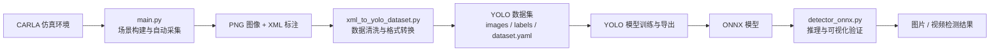

# 基于 CARLA 的交通标志检测项目说明与优化设计

本项目由三个核心脚本组成：

- [main.py](D:/software/workspace/Git/nn/src/driving_violation_detection/main.py)：在 CARLA 中自动采集交通标志图像与 XML 标注。
- [xml_to_yolo_dataset.py](D:/software/workspace/Git/nn/src/driving_violation_detection/xml_to_yolo_dataset.py)：将采集结果转换为 YOLO 可训练数据集。
- [detector_onnx.py](D:/software/workspace/Git/nn/src/driving_violation_detection/detector_onnx.py)：加载导出的 YOLO ONNX 模型并执行推理验证。

从项目链路看，它已经不只是一个单独的采集脚本，而是形成了一个相对完整的闭环：

```text
CARLA 场景构建与自动采集
  -> XML 标注生成
  -> YOLO 数据集转换
  -> ONNX 模型推理部署
```

下面按照“项目背景与优化动机、核心技术栈与理论基础、优化整体思路、针对性优化方案与实现、系统运行效果、功能扩展与未来规划和总结”七个部分进行说明。

---

## 1. 项目背景与优化动机

交通标志检测是智能驾驶感知系统中的基础任务。无论是违规行为识别、行车辅助，还是自动驾驶决策，系统都需要先具备稳定的环境感知能力，而交通标志识别正是其中的重要组成部分。

传统的数据构建方式通常面临几个明显问题：

- 真实道路采集成本高，数据回收周期长。
- 标注工作量大，尤其是检测框标注耗时明显。
- 天气、光照、道路流量等变量难以系统控制。
- 某些场景难以重复复现，不利于持续迭代算法。

基于这些问题，本项目选择使用 CARLA 仿真平台作为数据源，通过程序自动生成交通标志检测数据，再进一步转换为 YOLO 训练格式，并通过 ONNX 推理脚本完成部署侧验证。

从代码演进来看，这个项目本身也体现了较明确的“优化动机”：

### 1）从单纯采集，优化为“采集 + 标注”自动化

在 [main.py](D:/software/workspace/Git/nn/src/driving_violation_detection/main.py) 中，程序不只是抓取图像，还利用 CARLA 场景中的 3D 交通标志边界信息自动生成 XML 标注，减少了人工标注成本。

### 2）从原始样本，优化为“训练数据集结构化”

在 [xml_to_yolo_dataset.py](D:/software/workspace/Git/nn/src/driving_violation_detection/xml_to_yolo_dataset.py) 中，项目进一步把 XML 标注转换成 YOLO 所需的标签格式，并自动划分训练集和验证集，提升了数据集可训练性。

### 3）从训练端，优化为“部署端可验证”

在 [detector_onnx.py](D:/software/workspace/Git/nn/src/driving_violation_detection/detector_onnx.py) 中，项目又增加了 ONNX 模型加载、预处理、后处理和可视化逻辑，使整个系统从“能生成数据”走向“能落地验证推理效果”。

### 4）从静态场景，优化为多环境鲁棒性采集

`main.py` 中加入了多天气自动切换、背景车辆生成、去重采集和目标框筛选等逻辑，说明项目目标已经从“采到图”进一步优化为“采到更有效、更可训练的数据”。

因此，这个项目的核心背景可以概括为：

> 面向交通标志检测任务，构建一个从仿真数据自动采集、标签转换，到模型部署验证的完整工程链路，并通过一系列针对性优化提升数据质量、训练适配性和推理稳定性。

---

## 2. 核心技术栈与理论基础

本项目的技术栈比较清晰，可以分为仿真层、数据层、模型层和部署层四部分。

### 2.1 核心技术栈

| 技术 / 工具 | 用途 |
| --- | --- |
| Python 3.7 | 项目核心开发语言，负责仿真控制、数据处理与推理脚本编写 |
| CARLA 0.9.11 | 自动驾驶仿真平台，用于构建交通场景、生成交通标志真值信息和采集图像 |
| OpenCV 4.x | 图像读取、检测框绘制、窗口显示、视频读写与 ONNX 推理接口 |
| NumPy | 图像矩阵处理、投影计算、数值运算与检测输出解析 |
| Pygame | 键盘事件处理与交互控制，支持仿真过程中的输入扩展 |
| XML / Pascal VOC 标注 | 保存交通标志检测框、图像尺寸和环境标签等结构化标注信息 |
| YOLO 数据格式 | 训练阶段使用的目标检测标签格式，便于接入 YOLO 系列模型训练 |
| ONNX | 训练后模型的统一部署格式，用于跨框架推理与工程集成 |

上表概括了本项目最核心的开发与运行基础。围绕这些技术，项目进一步形成了“仿真采集、数据转换、模型推理验证”三段式工程流程。

### 2.1.1 项目流程图



### 2.2 仿真层：CARLA

CARLA 是一个面向自动驾驶研究的开源仿真平台，支持：

- 地图与道路网络仿真。
- 车辆、行人、交通灯、交通标志等 Actor 管理。
- RGB 相机等传感器建模。
- Python API 脚本控制。
- 同步模式和 Traffic Manager。

在本项目中，CARLA 主要承担三个作用：

- 提供可控的道路交通环境。
- 提供交通标志的三维几何信息。
- 提供多天气、多交通流条件下的数据采集能力。

相关代码位置：

- CARLA 接入与地图加载：`main.py:17-41`, `main.py:94`
- 同步模式配置：`main.py:97-105`
- 背景交通流生成：`main.py:48-62`, `main.py:113-118`

### 2.3 数据层：XML 标注与 YOLO 数据格式

`main.py` 生成的是接近 Pascal VOC 风格的 XML 标注，其中包含：

- 图像名
- 图像尺寸
- 目标类别
- 边界框坐标
- 天气标签

`xml_to_yolo_dataset.py` 再将 VOC 风格边界框转换成 YOLO 所需的归一化格式：

```text
class_id x_center y_center width height
```

转换公式如下：

```python
x_center = ((xmin + xmax) / 2.0) / width
y_center = ((ymin + ymax) / 2.0) / height
box_width = (xmax - xmin) / width
box_height = (ymax - ymin) / height
```

对应代码：`xml_to_yolo_dataset.py:28-36`

这里的理论基础是目标检测任务中最常用的矩形框表示与归一化编码方式，便于神经网络在不同尺寸图像上学习目标位置。

### 2.4 模型层：YOLO 检测思想

虽然当前仓库里没有训练脚本，但从 `xml_to_yolo_dataset.py` 和 `detector_onnx.py` 可以看出项目的模型路线是 YOLO 系列检测器。

YOLO 的核心思想是：

- 将目标检测视为单阶段回归问题。
- 直接预测目标类别和边界框。
- 以较高速度完成端到端检测。

在 [detector_onnx.py](D:/software/workspace/Git/nn/src/driving_violation_detection/detector_onnx.py) 中，ONNX 推理流程包括：

- 图像缩放与填充 `letterbox`
- `blobFromImage` 预处理
- ONNX 前向推理
- 置信度过滤
- NMS 去重
- 可视化绘制

相关代码位置：

- 预处理：`detector_onnx.py:37-60`
- 输出适配：`detector_onnx.py:62-79`
- 后处理与 NMS：`detector_onnx.py:80-143`

### 2.5 几何投影理论：3D 到 2D 映射

`main.py` 的关键优势在于它并不是人工标框，而是根据 CARLA 场景的三维几何信息投影生成二维框。

这里用到了典型的计算机视觉几何流程：

1. 获取交通标志在世界坐标中的顶点。
2. 通过世界到相机坐标变换矩阵完成坐标系转换。
3. 通过相机内参矩阵完成透视投影。
4. 取投影点的外接矩形作为 2D 检测框。

核心代码：

- 相机内参构建：`main.py:205-217`
- 点投影函数：`main.py:219-226`
- 交通标志框提取：`main.py:247-295`

### 2.6 后处理理论：IoU 与 NMS

项目中在采集端和推理端都体现了去重思想。

- 在采集端，`main.py` 自定义了 `compute_iou` 和 `non_maximum_suppression`。
- 在推理端，`detector_onnx.py` 使用 `cv2.dnn.NMSBoxes` 进行非极大值抑制。

其理论基础是：

- IoU 用于衡量两个框的重叠程度。
- NMS 用于保留高质量框、抑制冗余框。

对应代码：

- `main.py:452-486`
- `detector_onnx.py:117-137`

---

## 3. 优化整体思路

从整体工程链路来看，这个项目的优化思路可以概括为四个层次。

### 3.1 数据源优化

不是直接依赖真实道路采集，而是先使用 CARLA 构造可控、可重复、多样化的交通环境，解决数据采集成本与场景可控性问题。

### 3.2 标注质量优化

不是人工逐帧标注，而是利用仿真场景本身的三维几何信息自动生成二维框，并通过距离、方向、大小和纵横比筛选无效框，减少脏标注。

### 3.3 训练适配优化

不是只输出 XML，而是进一步构造成 YOLO 可直接训练的数据目录结构，并生成 `dataset.yaml`，降低从采集到训练之间的切换成本。

### 3.4 部署验证优化

不是停留在“数据准备完成”，而是继续向下游扩展到 ONNX 部署推理验证，通过统一的预处理和后处理逻辑验证模型在图片或视频上的实际表现。

因此，本项目的整体优化路径可以理解为：

```text
仿真自动采集
  -> 几何标注优化
  -> 数据集格式优化
  -> 检测模型部署优化
  -> 形成闭环验证
```

如果从工程价值上总结，这种思路的意义主要在于：

- 减少人工成本。
- 提高样本有效性。
- 缩短算法迭代周期。
- 提升从研究到部署的连贯性。

---

## 4. 针对性优化方案与实现

这一部分结合三个脚本，重点说明项目中已经完成的优化，以及这些优化是如何落到代码里的。

### 4.1 优化一：引入同步模式，提升采集稳定性

在 CARLA 采集任务中，如果采用异步模式，传感器帧、车辆状态和场景状态之间可能出现错位。项目通过同步模式和固定时间步长提升采集一致性：

```python
settings = world.get_settings()
settings.synchronous_mode = True
settings.fixed_delta_seconds = 0.05
world.apply_settings(settings)

traffic_manager = client.get_trafficmanager(8000)
traffic_manager.set_synchronous_mode(True)
```

对应代码：`main.py:97-105`

优化作用：

- 让 `world.tick()` 成为统一调度节拍。
- 保证传感器数据和世界状态更一致。
- 更适合高质量数据采集与可重复实验。

### 4.2 优化二：引入背景交通流，提升场景真实性

项目不是只生成一辆主车，而是先刷出 10 辆背景车，并统一开启自动驾驶：

```python
num_vehicles = 10
vehicles = spawn_vehicles(num_vehicles, world, spawn_points)

for v in vehicles:
    v.set_autopilot(True, traffic_manager.get_port())
```

对应代码：`main.py:113-118`

优化作用：

- 避免采集场景过于理想化。
- 让标志被遮挡、邻车干扰等情况更接近真实道路。
- 为后续鲁棒性训练提供更复杂背景。

### 4.3 优化三：通过几何约束筛选目标，减少无效标注

这是你之前已经做得比较关键的一部分优化。  
在 `get_signs_bounding_boxes(...)` 中，交通标志不会被无差别采集，而是经过多层筛选：

- 距离阈值过滤。
- 只保留车辆右侧目标。
- 只保留相机前方目标。
- 只保留完整落在图像中的目标框。
- 过滤面积过小的框。
- 过滤异常长宽比的框。

核心实现片段如下：

```python
if distance < DISTANCE_THRESHOLD:
    right_side_dot_product = dot_product(vehicle_right_vector, vector_to_object)
    if right_side_dot_product > 0:
        vector_to_camera = obj.location - camera_location
        camera_dot_product = dot_product(camera_transform.get_forward_vector(), vector_to_camera)

        if camera_dot_product > 0 and sign_location_tuple not in captured_sign_locations:
            verts = [v for v in obj.get_world_vertices(carla.Transform())]
            x_coords = [get_image_point(v, K, world_2_camera)[0] for v in verts]
            y_coords = [get_image_point(v, K, world_2_camera)[1] for v in verts]
            xmin, xmax = int(min(x_coords)), int(max(x_coords))
            ymin, ymax = int(min(y_coords)), int(max(y_coords))
```

对应代码：`main.py:255-287`

优化作用：

- 明显减少误标与无效样本。
- 保证标志框更接近实际可见目标。
- 为后续模型训练提供更干净的数据基础。

### 4.4 优化四：增加重复采集控制，提升数据多样性

你在 `main.py` 中通过 `captured_sign_locations` 和 `capture_cooldown` 控制同一交通标志不会被高频重复采集：

```python
captured_sign_locations = set()
last_capture_time = 0
capture_cooldown = 5
```

并在标志被成功识别后记录位置：

```python
current_time = time.time()
if current_time - last_capture_time > capture_cooldown:
    captured_sign_locations.add(sign_location_tuple)
    last_capture_time = current_time
```

对应代码：`main.py:240-245`, `main.py:289-293`

优化作用：

- 降低重复样本比例。
- 避免数据集中某些固定位置标志占比过高。
- 提高样本分布均衡性。

### 4.5 优化五：加入 NMS，抑制重复框

在投影过程中，一个交通标志可能形成冗余框，因此项目在采集端就进行了非极大值抑制：

```python
def non_maximum_suppression(bboxes, iou_threshold=0.2):
    if len(bboxes) == 0:
        return []

    bboxes = sorted(
        bboxes,
        key=lambda x: (x['xmax'] - x['xmin']) * (x['ymax'] - x['ymin']),
        reverse=True
    )

    final_bboxes = []
    while bboxes:
        current_box = bboxes.pop(0)
        final_bboxes.append(current_box)
        bboxes = [box for box in bboxes if compute_iou(current_box, box) < iou_threshold]

    return final_bboxes
```

对应代码：`main.py:471-486`

优化作用：

- 控制重复标注。
- 提升标注质量。
- 减少后续训练时一个目标对应多个框的问题。

### 4.6 优化六：加入多天气调度，扩展数据分布

项目已经实现了多天气自动切换，这也是比较有价值的一项优化。  
代码中定义了四种天气状态：

```python
weather_conditions = [
    'rainy',
    'sunny',
    'night',
    'foggy'
]
```

并在主循环中按固定间隔切换：

```python
if current_time - last_weather_change_time >= weather_transition_interval:
    current_condition = weather_conditions[current_condition_index]
    update_weather(world, current_condition)
    current_condition_index = (current_condition_index + 1) % len(weather_conditions)
    last_weather_change_time = current_time
```

对应代码：`main.py:345-350`, `main.py:506-515`

优化作用：

- 提高数据集的天气多样性。
- 改善模型对雨天、夜间和雾天场景的适应能力。
- 为后续做环境标签分析提供基础。

### 4.7 优化七：把 XML 标注自动转换为 YOLO 数据集

这一步是项目从“数据采集脚本”走向“训练工程”的关键优化。  
`xml_to_yolo_dataset.py` 自动完成以下工作：

- 匹配 XML 与图像文件。
- 解析 XML 中的尺寸和目标框。
- 把 VOC 框转换成 YOLO 标签。
- 划分 `train/val`。
- 复制图像与写入标签。
- 自动生成 `dataset.yaml`。

标签转换核心代码如下：

```python
for class_name, box in labels:
    class_id = class_to_id[class_name]
    x_center, y_center, box_width, box_height = voc_box_to_yolo((width, height), box)
    lines.append(
        f"{class_id} {x_center:.6f} {y_center:.6f} {box_width:.6f} {box_height:.6f}"
    )
```

对应代码：`xml_to_yolo_dataset.py:134-150`

同时它还加入了随机种子和比例切分：

```python
random.seed(args.seed)
random.shuffle(dataset_items)
split_index = int(len(dataset_items) * args.train_ratio)
```

对应代码：`xml_to_yolo_dataset.py:122-132`

优化作用：

- 打通采集与训练之间的数据格式障碍。
- 保证训练/验证切分可复现。
- 降低人工整理数据集的工作量。

### 4.8 优化八：部署端加入 ONNX 推理适配与可视化

`detector_onnx.py` 体现了另外一层优化，即从训练模型走向轻量部署验证。  
它并不是简单读取模型，而是把推理所需的关键步骤都补齐了。

#### 1）Letterbox 预处理

为了保证输入保持宽高比，同时适配网络固定尺寸，代码加入了 letterbox：

```python
scale = min(self.input_size / w, self.input_size / h)
new_w, new_h = int(round(w * scale)), int(round(h * scale))
canvas = np.full((self.input_size, self.input_size, 3), 114, dtype=np.uint8)
```

对应代码：`detector_onnx.py:37-49`

#### 2）兼容不同 ONNX 输出布局

这一点是很实用的工程优化。  
Ultralytics 导出的 ONNX 输出可能是 `[num_preds, 4+num_classes]`，也可能是 `[4+num_classes, num_preds]`，代码对这两种形式做了兼容：

```python
preds = np.squeeze(outputs)
if preds.ndim != 2:
    raise ValueError(f"Unexpected ONNX output shape: {outputs.shape}")

if preds.shape[0] < preds.shape[1] and preds.shape[0] <= 128:
    preds = preds.T
```

对应代码：`detector_onnx.py:62-78`

#### 3）推理后处理与 NMS

```python
indices = cv2.dnn.NMSBoxes(
    boxes,
    confidences,
    self.conf_threshold,
    self.iou_threshold
)
```

对应代码：`detector_onnx.py:114-137`

#### 4）图像和视频双模式验证

项目支持：

- `--image` 单图检测
- `--video` 视频或摄像头检测

对应代码：`detector_onnx.py:165-222`, `detector_onnx.py:225-260`

优化作用：

- 让模型可以快速在本地完成部署级验证。
- 便于直观观察模型检测框、置信度和实时表现。
- 形成“采集-训练-推理”的闭环验证路径。

---

## 5. 系统运行效果

从项目代码结构来看，系统运行后能够形成较完整的功能闭环，运行效果主要体现在以下几个方面。

### 5.1 数据采集效果

`main.py` 运行后，系统会：

- 启动 CARLA 并加载 `Town05`。
- 生成背景车辆和主车辆。
- 在主车上挂载 RGB 相机。
- 自动驾驶巡航采集交通标志。
- 将有效目标保存为 PNG 图像和 XML 标注。

输出目录为：

```text
OutPut/data01
```

对应代码：`main.py:180-189`, `main.py:545-555`

### 5.2 数据整理效果

`xml_to_yolo_dataset.py` 运行后，系统会生成标准 YOLO 训练目录，例如：

```text
dataset/
  images/train
  images/val
  labels/train
  labels/val
  dataset.yaml
```

并输出样本数、训练集数量、验证集数量和类别信息。  
对应代码：`xml_to_yolo_dataset.py:152-168`

### 5.3 推理验证效果

`detector_onnx.py` 运行后，可以对图片、视频或摄像头输入进行检测：

- 在画面上绘制检测框。
- 显示类别与置信度。
- 支持保存可视化结果。

对应代码：

- 绘制检测框：`detector_onnx.py:146-152`
- 图片推理：`detector_onnx.py:165-185`
- 视频推理：`detector_onnx.py:188-222`

### 5.4 当前系统效果的客观评价

从工程能力上讲，这个项目已经具备以下成果：

- 能自动采集交通标志样本。
- 能自动生成标注。
- 能自动转换为 YOLO 数据集。
- 能对导出的 ONNX 模型进行推理验证。

也就是说，它已经形成了一个比较完整的原型系统，而不是孤立的单脚本实验。

需要说明的是：我这次修改文档时没有直接运行 CARLA 仿真、数据转换脚本或 ONNX 推理，因此这里的“运行效果”是基于源码逻辑与工程流程整理出的系统级效果描述，而不是一次新的实测报告。

---

## 6. 功能扩展与未来规划

虽然当前项目已经形成闭环，但仍然有比较明确的扩展方向。

### 6.1 从单类别扩展到多类别感知

当前项目主要围绕 `TrafficSign` 一个类别展开。后续可以扩展到：

- 交通灯
- 车辆
- 行人
- 车道线
- 停车线
- 限速牌细分类

这样可以进一步服务于更完整的驾驶违规识别或场景理解任务。

### 6.2 从离线采集扩展到在线检测闭环

当前 `main.py` 和 `detector_onnx.py` 是分离的。后续可以考虑：

- 在 CARLA 采集过程中直接调用 ONNX 模型实时检测。
- 对比“仿真真值框”和“模型预测框”。
- 在线统计 precision、recall、mAP 等指标。

这会让系统从“离线数据工程”进一步走向“在线评估平台”。

### 6.3 增加更多域随机化能力

目前已有天气切换，后续可继续加入：

- 相机安装位姿随机化
- 车辆速度随机化
- 背景车密度随机化
- 时间段随机化
- 光照和阴影强度随机化
- 路面材质与纹理扰动

这有助于降低仿真到真实场景之间的域差异。

### 6.4 进一步优化数据筛选策略

当前已经做了距离、方向、面积和宽高比过滤，后续还可以加入：

- 遮挡率过滤
- 模糊度过滤
- 目标最小像素面积统计
- 类别分布均衡采样
- 质量评分后再入库

这样可以进一步提升训练集质量。

### 6.5 模块化重构

目前项目功能已经比较丰富，但代码仍然偏脚本式组织。后续可考虑拆分为：

- `collector.py`：采集模块
- `annotation.py`：标注模块
- `dataset_builder.py`：数据集构建模块
- `inference.py`：推理模块
- `config.py`：参数配置模块

这样更便于维护、测试和扩展。

### 6.6 增加训练与评估脚本

当前工程已经具备数据准备和部署验证环节，但中间的训练环节还没有纳入仓库主流程。后续可以补充：

- YOLO 训练脚本
- 评估脚本
- 模型导出脚本
- 自动化实验记录

进一步把系统打造成完整的“仿真数据驱动目标检测平台”。

---

## 7. 总结

基于这三个脚本构成的项目，已经形成了一个比较完整的交通标志检测工程链路：

- `main.py` 负责在 CARLA 中自动采集多天气、多交通流条件下的图像与 XML 标注。
- `xml_to_yolo_dataset.py` 负责把仿真数据整理成 YOLO 可训练格式。
- `detector_onnx.py` 负责对导出的检测模型进行 ONNX 推理验证。

更重要的是，这个项目并不是简单把功能拼起来，而是已经体现出较清晰的优化思路：

- 通过同步模式提升采集稳定性。
- 通过背景交通流提升场景真实性。
- 通过几何约束和 NMS 提升标注质量。
- 通过去重采集提升样本多样性。
- 通过多天气调度扩展数据分布。
- 通过数据集转换打通训练流程。
- 通过 ONNX 推理验证打通部署流程。

从工程定位上说，这个项目可以被理解为一个面向交通标志检测任务的轻量级智能驾驶数据闭环系统。  
它既具有教学和研究价值，也具备继续扩展为完整实验平台的基础。

如果后续继续迭代，最值得优先推进的方向通常有三个：

1. 增加训练与评估脚本，补全完整实验闭环。
2. 扩展类别与场景随机化能力，提升泛化性。
3. 将采集、训练、推理模块进一步解耦，做成更标准的工程化结构。

这样一来，这个项目就可以从“交通标志检测原型系统”逐步演进成“面向智能驾驶感知任务的仿真数据平台”。
