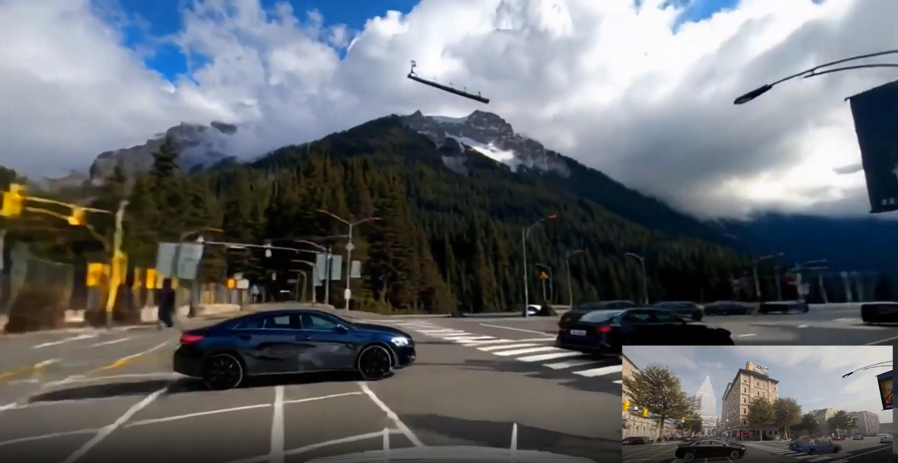
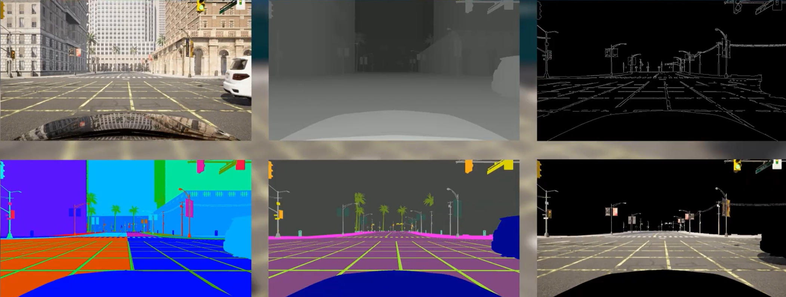

# Carla 和 Cosmos Transfer 协同工作

Carla 可以连接到 NVIDIA Cosmos Transfer，以创建 Carla 中生成的合成数据的超逼真变体。



在此集成中，Carla 生成一系列视频，包括 RGB 图像、语义分割图像、深度图像和边缘图像，用于控制 Cosmos Transfer。这些控制视频由 `carla_cosmos_gen.py` 脚本生成。Cosmos Transfer 将这些控制视频与文本提示和一些额外的调整参数结合使用，以生成视频的新变体。




此集成采用客户端-服务器架构。`cosmos_client.py` 脚本向 Cosmos Transfer 服务器发送查询，服务器负责完成请求并将视频发送回客户端（此过程需要 1-2 分钟）。为此，用户需要先部署 Cosmos Transfer 服务。下一节将介绍部署您自己的 Cosmos Transfer 服务的不同选项。

* __[部署 Cosmos Transfer 服务器](#deploying-a-cosmos-transfer-server)__
    * [方案 1：在 NVIDIA Brev 上一键部署](#option-1-1-click-deployment-on-nvidia-brev)
    * [方案 2：将您自己的服务部署到其他地方](#option-2-deploying-your-own-service-somewhere-else)
* __[使用 Carla x Cosmos Transfer 客户端](#using-the-carla-x-cosmos-transfer-client)__
    * [依赖项安装](#installing-dependencies)
    * [生成 Cosmos-Transfer 控制输入](#generating-cosmos-transfer-control-inputs)
    * [使用 Cosmos Transfer 生成风格迁移变体](#generating-style-transfer-variations-using-cosmos-transfer)
    * [Understanding the Cosmos-Transfer configuration](#understainding-the-cosmos-transfer-configuration)

--- 
# 部署 Cosmos Transfer 服务器

Cosmos Transfer 需要高性能数据中心 GPU，例如 NVIDIA H100。我们创建了多种轻松部署 Cosmos Transfer 服务器的方法。

## 方案 1：在 NVIDIA Brev 上一键部署

Carla 团队创建了一个 Brev 启动器，使用户能够轻松创建自己的 Cosmos Transfer 服务器。为此：

__1.__ 点击 [此处](https://login.brev.nvidia.com/signin) 注册Brev账号。

__2.__ 请按照网站上的说明为您的账户充值。

__3.__ 请访问链接 [carla-x-cosmos-transfer1-lambda](https://brev.nvidia.com/launchable/deploy/now?launchableID=env-32CoARmRgbQdxkQeHHkWfvRj87T) 。

__4.__ 点击“部署可启动项(Deploy Launchable)”。


__5.__ 点击“前往实例页面(Go to Instance Page)”。


__6.__ 等待实例启动。


__7.__ 将 URL 公开。


__7.__ 您的 Cosmos Transfer 服务已准备就绪！

!!! 注意
    您可能会遇到特定云服务商提供的 GPU 实例数量有限的情况。在这种情况下，请尝试按以下步骤切换到其他云服务商： 
    { style="padding:1rem;" }
    { style="padding:1rem;" }

---

## 方案 2：将您自己的服务部署到其他地方

如果您拥有合适的硬件，可以将 Cosmos Transfer 部署在 Docker 容器中。构建服务器镜像所需的文件位于 Carla 安装目录或软件包根目录下的 `PythonAPI/examples/nvidia/cosmos/server` 目录中。

__1.__ **安装 Docker**: 如果您的系统上尚未安装 Docker，[请安装它](https://docs.docker.com/engine/install/) 。

__2.__ **安装 Conda**: 请按照 [这些说明](https://docs.conda.io/projects/conda/en/latest/user-guide/install/index.html) 安装 Conda。

__3.__ **构建服务器**: 在 `PythonAPI/examples/nvidia/cosmos/server` 目录下打开终端，并运行 `make_docker.sh` 脚本：

```sh
./make_docker.sh
```

这一步骤可能需要 1-2 小时。

__4.__ __部署__: 在您选择的环境中部署 Docker 镜像。我们建议使用至少配备 8 个 H100 GPU 的集群。对于较低的工作负载，单个 H100 GPU 就足够了。使用以下命令运行 Docker 镜像：

```bash
docker run -d --shm-size 96g --gpus=all --ipc=host -p 8080:8080 cosmos-transfer1-carla
```

__5.__ __使用客户端发起请求__: 部署好 Cosmos 服务器后，您可以使用 `cosmos_client.py` 脚本向其发出请求，并为 `endpoint` 参数提供相应的 IP 地址和端口。

例如，对于本地部署在 8080 端口的服务器：

```sh
python cosmos_client.py http://localhost:8080 example_data/prompts/rain.toml
```

---

# 使用 Carla x Cosmos Transfer 客户端

要开始生成视频，您需要安装 Cosmos Transfer 客户端的 [依赖项](#installing-dependencies) 。Cosmos Transfer 生成过程包括两个步骤：

__1.__ [__使用 Carla 为 Cosmos Transfer 生成控制视频__](#generating-cosmos-transfer-control-inputs)

>此步骤会根据 Carla 仿真日志文件生成多个用于 Cosmos Transfer 的控制视频。生成的视频可能包括以下内容：
>
>* RGB
>* 深度
>* Edges
>* 语义分割
>* 实例分割
>* Sky mask

__2.__ [__使用 Cosmos Transfer 生成风格迁移变体__](#generating-style-transfer-variations-using-cosmos-transfer1)

>此步骤使用 Cosmos Transfer1 模型生成原始控制视频的风格迁移变体。Carla 生成的控制视频被发送到运行 Cosmos Transfer1 模型的服务器。请求通过使用 `cosmos_client.py` 脚本的简单 API 发送到服务器。 

>Cosmos Transfer1 模型可以通过 TOML 文件中定义的提示符和其他几个控制参数进行控制。您可以在 `client/example_data/prompts` 目录中找到许多 Cosmos Transfer1 配置示例。

---

## 依赖项安装

__1.__ 下载 Carla [0.9.16](https://github.com/carla-simulator/carla/releases/tag/0.9.16) 或者 [最新的夜晚构建](https://carla.readthedocs.io/en/latest/download/#nightly-build)

__2.__ 下载完成后，解压缩文件：

```sh
tar -xzvf  CARLA_0.9.16.tar.gz
```

__3.__ 请按照 [这些说明](https://docs.conda.io/projects/conda/en/latest/user-guide/install/index.html) 安装 `conda`。如果您的系统已安装 conda，则可以跳过此步骤。

__4.__ 创建一个 conda 环境（例如 `carla-cosmos-client`），并安装所有依赖项：

```sh
cd PythonAPI/examples/nvidia/cosmos
# 创建 carla-cosmos-client conda 环境
conda env create --file client/carla-cosmos-client.yaml
# 激活 carla-cosmos-client conda 环境
conda activate carla-cosmos-client
# 安装依赖项
pip install -r requirements.txt
pip install -r client/requirements_client.txt 
```
__5.__ 要安装 Carla Python 客户端，请导航至 Carla 安装目录下的 `PythonAPI/carla/dist` 文件夹。找到与您的 Python 版本对应的 .`.whl` 文件（例如，`carla-0.9.16-cp310-cp310-linux_x86_64.whl`）： 
```sh
# 将 carla-0.9.16-cp310-cp310-linux_x86_64.whl 替换为您的实际文件名
pip install carla-0.9.16-cp310-cp310-linux_x86_64.whl
```

---

## 生成 Cosmos-Transfer 控制输入

__1.__ __启动 Carla__

>导航至 Carla 安装的根文件夹并执行启动脚本：
```sh
./CarlaUE4.sh
```

__2.__ __从 Carla 日志生成控制视频__

>如果您想使用示例生成新的控制输入，可以运行 `PythonAPI/examples/nvidia/cosmos/client/carla_cosmos_gen.py`，并使用位于 PythonAPI/examples/nvidia/cosmos/client/example_data/logs/inverted_ai/ 目录下的名为 **iai_carla_synthetic_log_1731622446_actorPOV4641_startTime3.7s_log.log** 的示例日志文件。您还可以在同一目录下找到其他几个示例日志文件，供您进行实验。

>典型的调用方式如下：

```sh
cd PythonAPI/examples/nvidia/cosmos/client
# 将 /full_path_to_log/your_log.log 替换为日志文件的绝对路径，将 output_path 替换为存储结果的路径（可以是相对路径）
python carla_cosmos_gen.py -f full_path_to_log/your_log.log --sensors cosmos_aov.yaml --class-filter-config filter_semantic_classes.yaml -c ego_sim_id -s 0.0 -d 5.0 -o output_path
```

>`ego_sim_id` 值是自我载具的 Actor ID，供 Cosmos 生成脚本识别。如果您正在录制自己的场景，请务必记下 `id` 属性中的自我载具 Actor ID。

>例如：

```sh
 python carla_cosmos_gen.py -f ${PWD}/example_data/logs/inverted_ai/iai_carla_synthetic_log_1731622446_actorPOV4641_startTime3.7s_log.log \ 
 --sensors cosmos_aov.yaml \
 --class-filter-config filter_semantic_classes.yaml \
 -c 4641 -s 0.0 -d 5.0 -o output
```

>**注意**: 对于示例日志，请将 `ego_sim_id` 替换为 4641。

>这将生成一系列视频，这些视频随后将用于控制 Cosmos Transfer。

---

## 使用 Cosmos Transfer 生成风格迁移变体

准备好一组工件，并且 Cosmos Transfer 服务已部署并激活后，即可使用 `cosmos_client.py` 脚本发出请求。以下命令将根据 `client/example_data/prompts` 目录下的 `rain.toml` 示例配置文件中的提示和参数，生成 Cosmos Transfer 风格迁移视频。

```sh
cd PythonAPI/examples/nvidia/cosmos/client
# 将 https://url_to_server 替换为您的 CARLA-Cosmos-Transfer 服务器的 URL
python cosmos_client.py http://url_to_server:port example_data/prompts/rain.toml
```

您可以通过编辑 `rain.toml` 配置文件中的文本提示和控制参数来进行实验并查看效果。同一目录下还提供了许多其他示例，您可以在 [下一节](#understainding-the-cosmos-transfer-configuration) 中了解更多关于这些参数的信息。

您可以通过命令行选择性地覆盖 TOML 中的某些字段，并选择输出的保存位置：*http://localhost:8000/ts_traffic_simulation_overview/*

```sh
python cosmos_client.py http://url_to_server:port \
  example_data/prompts/rain.toml \
  --output outputs/ \
  --input-video example_data/artifacts/rgb.mp4 \
  --edge-video example_data/artifacts/edges.mp4 \
  --depth-video example_data/artifacts/depth.mp4 \ # optional
  --seg-video example_data/artifacts/semantic_segmentation.mp4 \
  --vis-video example_data/artifacts/vis_control.mp4 \ # optional
  --seed 2048
```

---

## 了解 Cosmos-Transfer 配置

本节介绍 TOML 配置（参见 `example_data/prompts/rain.toml`）。客户端接受如下所示的扁平模式，也支持将相同的键嵌套在顶层 `controlnet_specs` 表中。

### 必填字段

| 字段                | 类型    | 描述 |
|----------------------|---------|-------------|
| `prompt`             | string  | 描述所需场景的文本 |
| `input_video_path`   | string  | 输入视频文件的路径 |
| `negative_prompt`    | string  | 描述输出中应避免的内容的文本 |
| `num_steps`          | int     | 扩散步数 |
| `guidance`           | float   | CFG 指导尺度 |
| `sigma_max`          | float   | 输入信号中添加部分噪声；[0, 80]。`>= 80` 表示忽略输入视频。 |
| `seed`               | int     | 为了保证可复现性，使用了随机种子。 |

### 可选标量字段

| 字段              | 类型   | 描述 |
|--------------------|--------|-------------|
| `blur_strength`    | string | 用于准备视觉 `vis` 控制输入的模糊强度。取值范围： `very_low`, `low`, `medium`, `high`, `very_high` |
| `canny_threshold`  | string | 外部生成边缘时使用的可选阈值预设 |

### 控制（均为可选）

如果设置控制项，则必须遵循以下规则：

| 控制 | 所需 keys                              | 笔记 |
|---------|--------------------------------------------|-------|
| `edge`  | `input_control` (string)<br>`control_weight` (number) | 路径通常指向视频边缘。 |
| `depth` | `input_control` (string)<br>`control_weight` (number) | 路径指向深度视频 |
| `seg`   | `input_control` (string)<br>`control_weight` (number) | 路径指向语义分割视频 |
| `vis`   | `control_weight` (number)                  | `input_control` 是可选的 |

#### 验证约束

客户端在发送数据前会验证以下几个方面：

__1.__ 以上所有必需的标量字段必须存在且类型正确。

__2.__ 控制参数是可选的。如果提供了 `edge`、`depth` 或 `seg` 参数，则 `control_weight` 和 `input_control` 都必须存在。如果提供了 `vis` 参数，则 `control_weight` 必须存在，而 `input_control` 是可选的。

示例 TOML 文件位于 `client/example_data/prompts/` 中。

### 命令行参数

`cosmos_client.py` 接受以下参数：

| 参数             | 类型    | 描述 |
|----------------------|---------|-------------|
| `endpoint`           | string  | 服务器的基本 URL（例如， `http://localhost:8080`） |
| `config_toml`        | string  | TOML 配置路径 |
| `--output`           | string  | 保存结果视频的文件或目录路径 |
| `--input-video`      | string  | 从 TOML 文件中覆盖 `input_video_path` |
| `--edge-video`       | string  | 覆盖 `edge.input_control` |
| `--depth-video`      | string  | 覆盖 `depth.input_control` |
| `--seg-video`        | string  | 覆盖 `seg.input_control` |
| `--vis-video`        | string  | 覆盖 `vis.input_control` |
| `--seed`             | int     | 覆盖 `seed` |
| `--retries`          | int     | 上传和生成的最大重试次数（默认值：3） |
| `--backoff-initial`  | float   | 初始退避 backoff 秒数（默认值：1.5） |
| `--backoff-multiplier` | float | 指数退避乘数（默认值：2.0） |
| `--jitter`           | float   | 随机抖动添加到退避机制中（默认值：0.5） |
| `--poll-interval`    | int     | 轮询作业状态的间隔时间（秒）（默认值：5） |
| `--result-timeout`   | int     | 获取作业结果的超时时间（秒）（默认值：120） |

